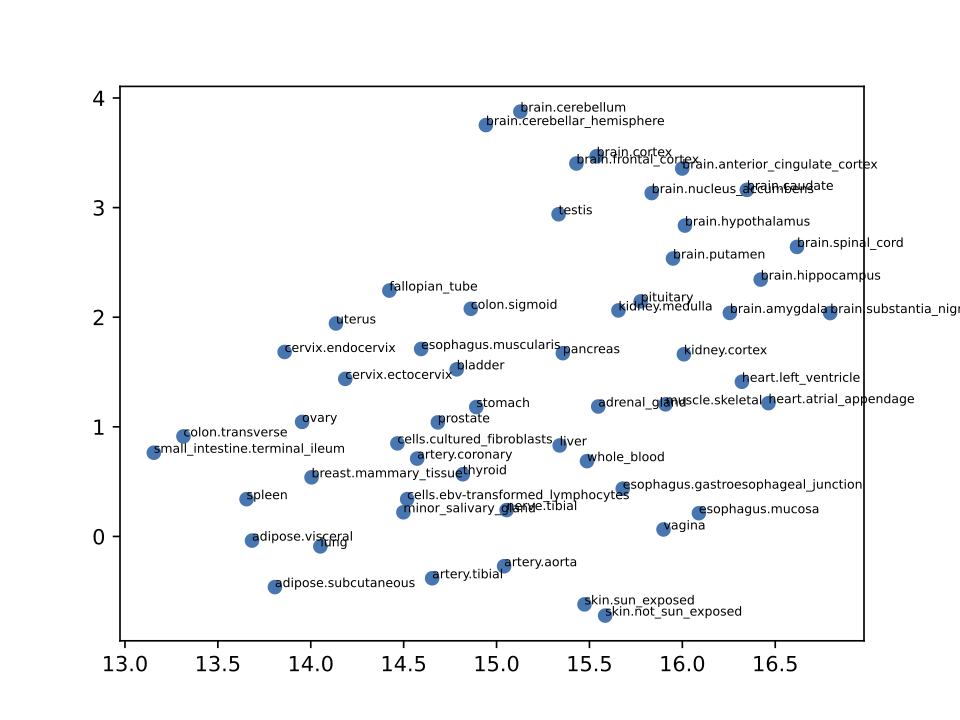
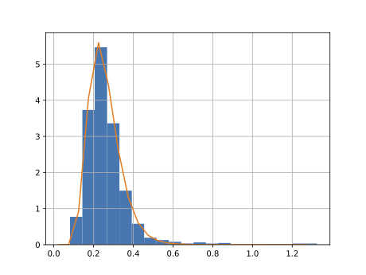
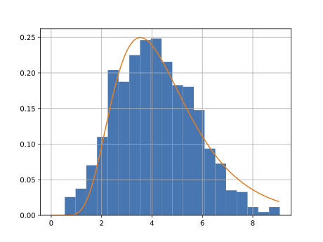
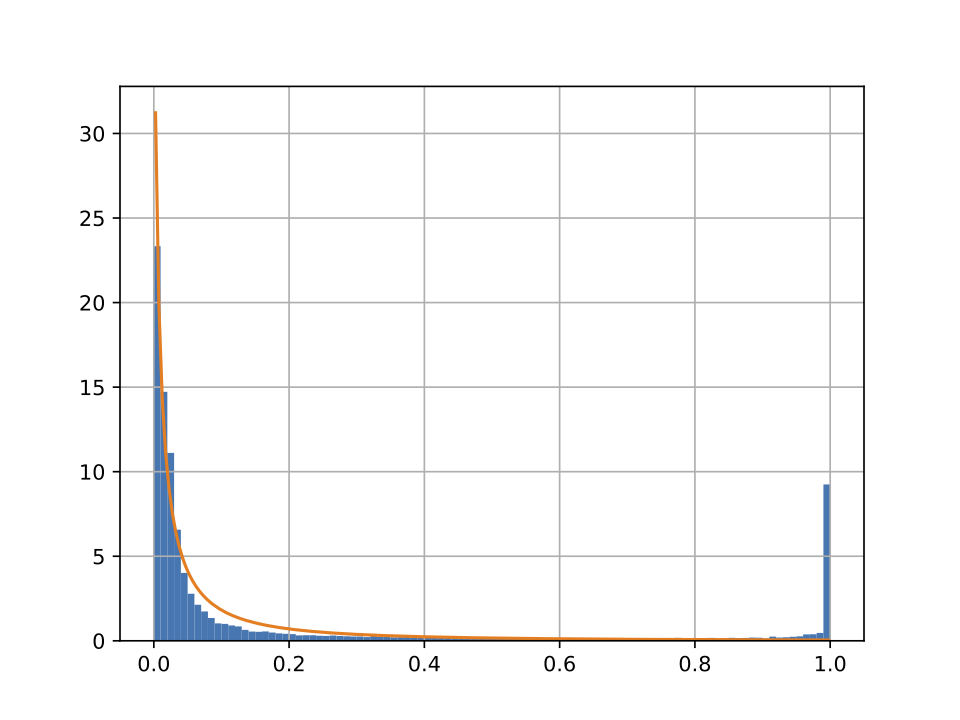
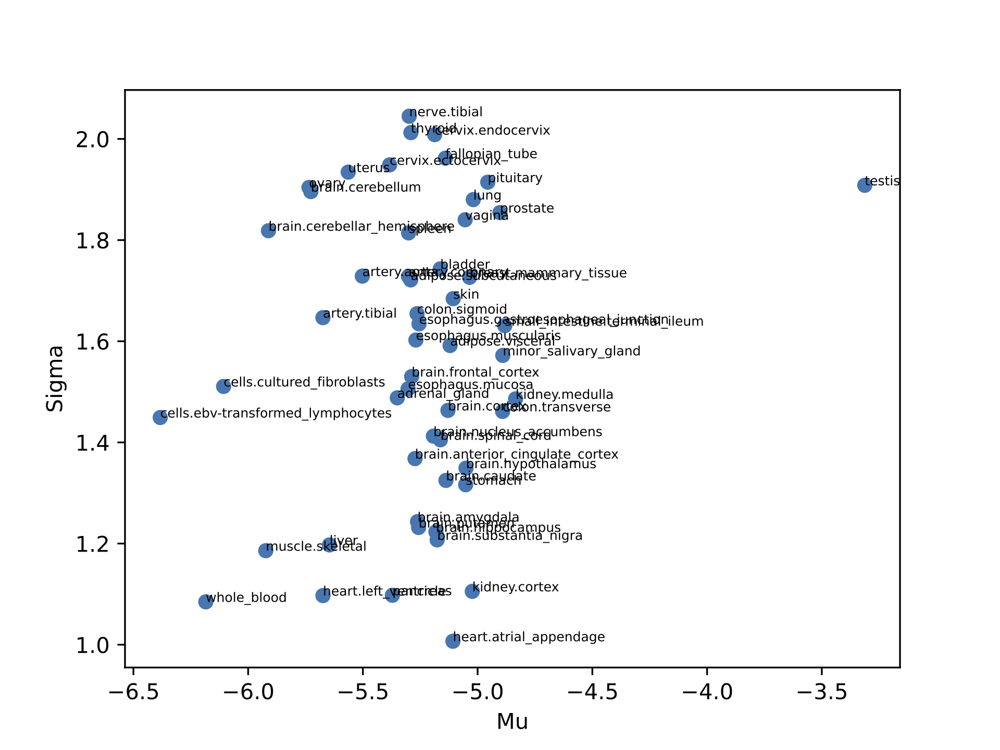

# tissue_enrichment

Given an  input set of gene names and their associated weights, such as from the output of SWIFR or another mechanism for identifying selective sweeps, identify the tissue with the greatest enhancement, along with an associated p-value via bootstrapping.

Sugden Lab, Duquesne University, 2022


### Steps for use:
1. Download ```GTEx_Analysis_2017-06-05_v8_RNASeQCv1.1.9_gene_median_tpm.gct``` from https://gtexportal.org/home/datasets

1. Download ```Total Approved Symbols``` under ```Statistics``` in TXT format (the blue button in the right column at the bottom of the first block) from https://www.genenames.org/download/statistics-and-files/

1. Convert raw data into an appropriate CSV format for reading. Run script ```1_process_raw_gct_to_graph.py```. Note that duplicate alias names (not ensembl_gene_ids) will be dropped. This includes: 
```'y_rna', 'snora63', 'metazoa_srp', 'u1', 'nbpf13p', 'snora44',
       'rgs5', 'snora77', 'scarna20', 'prox1-as1', 'u3', 'snora51',
       'linc01347', 'linc01115', 'snora2', 'uc_338', 'u4', 'linc01238',
       'snora64', 'cyb561d2', 'snora4', 'snora48', 'aca64', 'snora31',
       'rps23p5', 'snora70', 'snora67', '5s_rrna', 'snora40',
       'raet1e-as1', 'snou13', 'snora22', 'snora15', 'mal2', 'snora12',
       'lynx1', 'snora26', 'linc00484', 'u8', 'ctslp2', 'snora11',
       'dnajc9-as1', 'snora19', 'snord22', 'alg1l9p', 'snora75',
       'or7e47p', 'linc01481', 'snora9', 'spata13', 'snora27', 'snora42',
       'snora32', 'snora79', 'golga8m', 'snora46', 'snora74', '7sk',
       'snora21', 'scarna24', 'snou109', 'snora81', 'snora73', 'snora68',
       'linc01598', 'snora71', 'linc01297', 'linc01422', 'elfn2'
```

1. ANALYSIS: Check that different tissues are relatively equally distributed. See conclusion 1 below. Run script ```2_check_tissue_distances.py```

1. Create aliases for gene names from HUGO. Run script ```3_create_hugo_aliases.py```

1. ANALYSIS: Check the relative distribution of transcripts in different tissues. Run script ```4_compare_tissue_gene_distributions.py```


### Library files
```gene_alias_from_hugo.py```: Read in Hugo data, combine aliases, and create an index that can be searched to identify the best matching ensembl_gene_id.

```stats.py```: UNFINISHED-- primary output file for website

```tissue_scores_from_gct.py```: Code to read GTEX file to get gene transcript levels, convert to a graph, and simplify titles for future processing. Also standardizes edges.

```tscores.py```: Class to read in GTEX edge weights as well as hugo files for searching. Also includes code for randomization of statistics.


### Pre-Analysis conclusions:
1. Tissues show few clusters that might cause problems with ranking, with the exception perhaps of skin exposed and not exposed to the sun. Therefore, those two tissues are combined in ```tissue_scores_from_gct.py``` for all future analyses. 

1. Testis shows overexpression and a massive number of unique genes (found from compare_tissue_gene_expression.py). For example, see X-axes in adipose versus testis: 

 
. 

This is for 20 randomly sampled genes. If we include all of them, there is a bimodal distribution. 

. 

We can compare the coefficients of log-normal fits to the histograms (orange lines) and we see that testis stands out radically.


. 